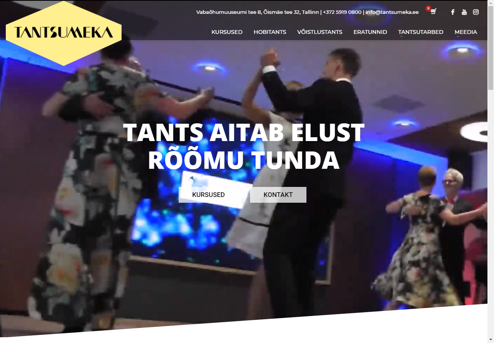

## Tantsumeka

# Pilt avalehest

# Eesmärk
Luua Tantsumekale uus ja tänapäevane veebileht, mis toimiks ka nutiseadmetes. Klient soovis lehele uut disaini, poodi, foorumit ning registreerimisvormi.

# Projekt tehti suveprojekti raames Tallinna Ülikoolis

# Kasutatud tehnoloogiad
Zone-i virtuaalserver
Wordpress Versioon 4.9.6
Adobe Photoshop
Adobe Illustrator
Cyberlink PowerDirector

# Grupi liikmed
Riho Noormets, Egert Piksar, Kert Tamm, Kevin Kodasma, Egert Klaamas

# Paigaldusjuhised
1. Minge serverisse, kus leht üleval on  
2. Minge kausta public_html  
3. Kõik failid seal kaustas laadige alla  
4. Laadige failid üles uude serveri  
5. Vajadusel registreerige uus domeen  
6. wp-config.php kaudu tuleb uuendada wordpress andmebaasi nime, kasutajanime ning parooli  
7. Vaheta nimeserverid õigete vastu  
